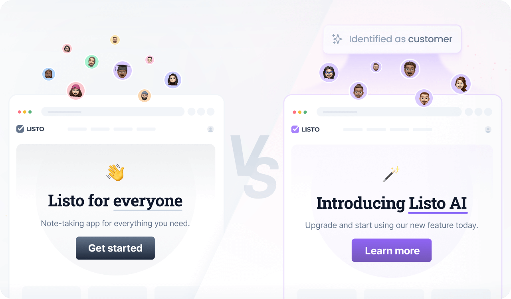

# Introduction

This template defines a personalized experience for SaaS visitors identified as existing customers.



By segmenting customers from new visitors, the experience can emphasize loyalty-building through exclusive benefits,
rewards, and product recommendations based on purchase history.

## What's included

This experience includes 3 components, 2 slots (an announcement bar and a home hero section), and the following
audience:

```cql
user's activities include "login" and user's plan is not "free"
```

Define custom audiences using the [Contextual Query Language (CQL)](https://docs.croct.com/reference/cql/introduction),
a readable, natural-language-inspired syntax designed for flexibility and ease of use. It supports
profile [enrichment with first-party data](https://docs.croct.com/reference/sdk/javascript/data-collection) and allows
the use of [custom attributes](https://docs.croct.com/reference/cql/data-types/user/user) to fine-tune personalization
strategies.

> [!IMPORTANT]
> Personalization with the `user's activities` and other custom variables requires
> implementing [data collection](https://docs.croct.com/reference/sdk/javascript/data-collection) in advance.

## Usage

To create a new experience using this template, run:

```croct-cmd
croct@latest use croct://experience/saas/customer
```
