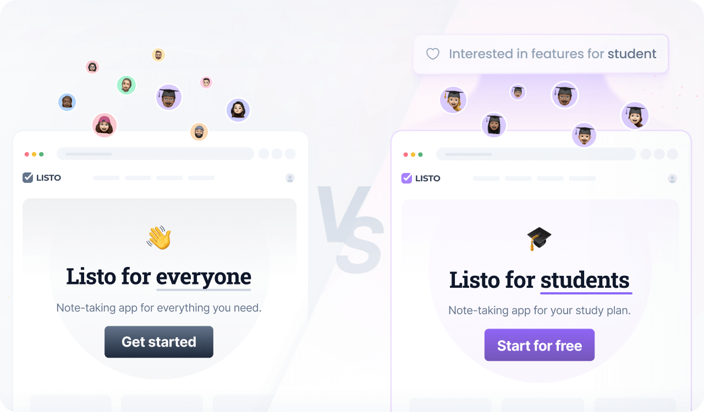

# Introduction

This template defines a personalized experience for SaaS websites that uses data from multiple sources, such as onsite
behavior and inferred [interests](https://docs.croct.com/reference/cql/data-types/user#user-interests-prop), to deliver
tailored recommendations for products, blog posts, and other offerings.



## What's included

This experience includes 4 components, 3 slots (a home hero, a home featured topics, and a testimonials sections), and
the following audience:

```cql
user's interests includes "student"
```

Define custom audiences using the [Contextual Query Language (CQL)](https://docs.croct.com/reference/cql/introduction),
a readable, natural-language-inspired syntax designed for flexibility and ease of use. It allows, for instance, to add
two or more interests to the same audience
using [or](https://docs.croct.com/reference/cql/expressions/operations/logical#or), [and](https://docs.croct.com/reference/cql/expressions/operations/logical#and),
or [these quantifiers](https://docs.croct.com/reference/cql/expressions/quantifiers).

> [!IMPORTANT]
> Personalization with the `user's interests` variable requires
> implementing [data collection](https://docs.croct.com/reference/sdk/javascript/data-collection) in advance.

## Usage

To create a new experience using this template, run:

```croct-cmd
croct@latest use croct://experience/saas/interest
```
