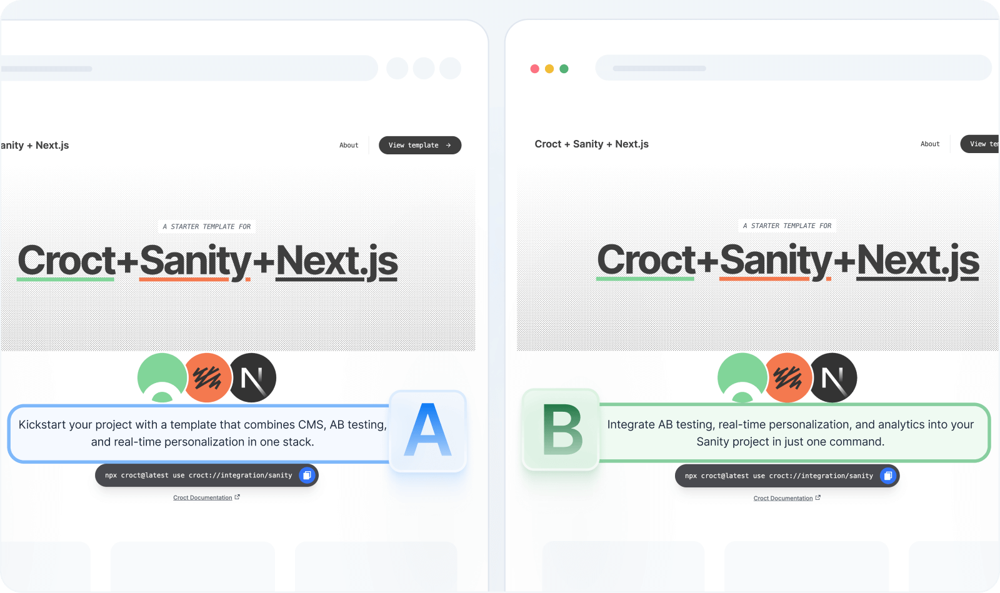

# Introduction

Looking to add **AB testing** to your Sanity-powered site?

This template
combines [Sanity.io](https://www.sanity.io/?utm_source=croct), [Next.js](https://nextjs.org/?utm_source=croct), and
Croct to help you run experiments and analyze results without changing your CMS or integrating with other third-party
analytics tools.

It's the fastest way to add experimentation on top of Sanity Studio.

Unlike currently available plugins, you can run experiments at the component level rather than the field level. Croct
replaces static component content with dynamic content, allowing you to manage everything directly on the UI while using
Sanity content as a [fallback](https://docs.croct.com/reference/sdk/nextjs/content-rendering#fault-tolerance).

Since it comes with built-in audience segmentation and analytics, there's no need to work on extra integrations with
CDPs to segment visitors or analytics tools to gather insights.

Using Croct, you get:

* AB testing support with real-time audience segmentation
* Built-in analytics and Bayesian analysis for every variant and experience
* Seamless compatibility with your existing Sanity schemas
* Fast implementation with zero CMS migration

> [!NOTE Forever-free]
> This template is compatible with features available on the forever-free plan.

## What's included

Besides the integration itself, this template creates an AB test for all users who browse the website, splitting them
into two variants, each with 50% of the traffic.

As an example, the home hero content difference lies in the tagline:

* **Variant A:** _Kickstart your project with a template that combines CMS, AB testing, and real-time personalization in
  one stack._
* **Variant B:** _Integrate AB testing, real-time personalization, and analytics into your Sanity project in just one
  command._



## Usage

Run the following command in an empty directory to create a new example project using this template:

```croct-cmd
croct use croct://integration/sanity-ab-testing
```
