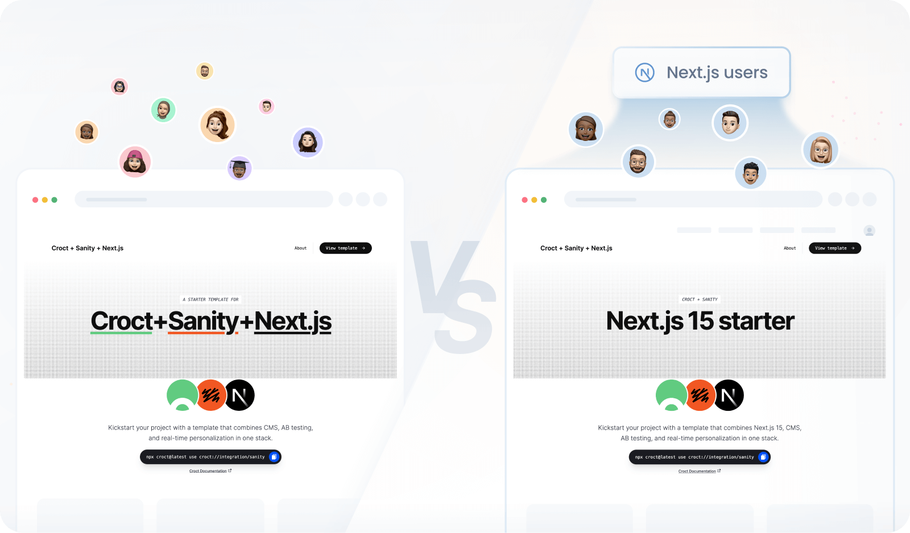

# Introduction

Looking to add **content personalization** to your Sanity-powered site?

This template
combines [Sanity.io](https://www.sanity.io/?utm_source=croct), [Next.js](https://nextjs.org/?utm_source=croct), and
Croct to help you apply personalized experiences and analyze results without changing your CMS or integrating with other
third-party analytics tools.

It's the fastest way to add content personalization on top of Sanity Studio.

Unlike currently available plugins, you can personalize content at the component level rather than the field level.
Croct replaces static component content with dynamic content, allowing you to manage everything directly on the UI while
using Sanity content as a [fallback](https://docs.croct.com/reference/sdk/nextjs/content-rendering#fault-tolerance).

Since it comes with built-in audience segmentation and analytics, there's no need to work on extra integrations with
CDPs to segment visitors or analytics tools to gather insights.

Using Croct, you get:

* Content personalization based on location, behavior, or custom rules
* Built-in analytics and Bayesian analysis for every variant and experience
* Seamless compatibility with your existing Sanity schemas
* Fast implementation with zero CMS migration

> [!NOTE Forever-free]
> This template is compatible with features available on the forever-free plan.

## What's included

Besides the integration itself, this template creates a personalized experience for users that use Next.js 15.

As an example, the home hero content difference lies in the title and tagline:

* **Default heading:** _Croct + Sanity + Next.js_
* **Personalized heading:** _Next.js 15 starter_



## Usage

Run the following command in an empty directory to create a new example project using this template:

```croct-cmd
croct use croct://integration/sanity-personalization
```
