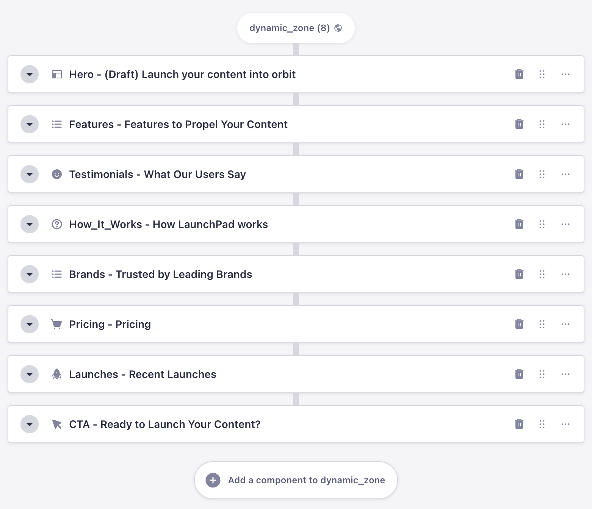
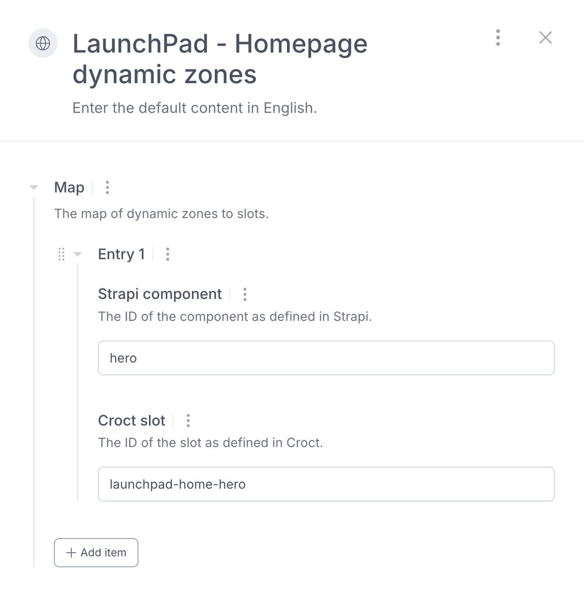

# Introduction

Looking to add **dynamic content blocks** to your Strapi-powered site?

This template
combines [Strapi.io](https://strapi.io?utm_source=croct), [Next.js](https://nextjs.org/?utm_source=croct), and
Croct to help you implement dynamic content without changing your CMS.

It's the fastest way to add AB testing and personalization on top of Strapi.

Croct replaces static component content with dynamic content, allowing you to manage everything directly on the UI while
using Strapi content as a [fallback](https://docs.croct.com/reference/sdk/nextjs/content-rendering#fault-tolerance).

Since it comes with built-in audience segmentation and analytics, there's no need to work on extra integrations with
CDPs to segment visitors or analytics tools to gather insights.

Using Croct, you get:

* AB testing support with real-time audience evaluation
* Content personalization based on location, behavior, or custom rules
* Built-in analytics and Bayesian analysis for every variant and experience
* Seamless compatibility with your existing Strapi schemas
* Fast implementation with zero CMS migration

> [!NOTE Forever-free]
> This template is compatible with features available on the forever-free plan.

## How it works

This template leverages the
Strapi [dynamic zones](https://strapi.io/blog/how-to-create-pages-on-the-fly-with-dynamic-zone?utm_source=croct)
feature. In Strapi, a dynamic zone is a field that allows you to create flexible content structures by combining
different types of components. Think of it as a container where you can choose and arrange different reusable blocks to
build your content pages.

The homepage contains 8 sections, as follows:



To integrate Croct [slot](https://docs.croct.com/explanation/slot) into Strapi, all you have to do is map your
components and slots:



> [!NOTE Official Strapi integration guide]
> Check [this article](https://strapi.io/integrations/croct?utm_source=croct) for more details about Strapi integration.

## Usage

Run the following command in an empty directory to create a new project using this template:

```croct-cmd
croct use croct://integration/strapi
```
